# Aspire Ecommerce Microservices

A modular, production-grade microservices solution for ecommerce, built with .NET Aspire. This repository demonstrates
scalable architecture, clean code principles, CQRS pattern implementation, and modern cloud-native patterns. Currently
implements a Catalog microservice with plans for expansion to Basket, Order, and other services.

---

## Table of Contents

- [Solution Structure](#solution-structure)
- [Getting Started](#getting-started)
- [Architecture Overview](#architecture-overview)
- [Microservices](#microservices)
- [Technical Stack](#technical-stack)
- [Development Guidelines](#development-guidelines)
- [Extending the Platform](#extending-the-platform)
- [Contributing](#contributing)
- [License](#license)

---

## Solution Structure

```
Aspire_Ecommerce_Microservices/
│
├── Aspire/
│   ├── AppHost/                # Main orchestration and dependency management
│   │   ├── Extensions/         # Infrastructure extension methods
│   │   └── AppHost.cs          # Service composition and configuration
│   ├── ServiceDefaults/        # Shared service configurations (resilience, telemetry)
│   └── Directory.*.props       # Centralized build and package management
│
├── BuildingBlocks/             # Reusable components across services
│   ├── CQRS/                   # Command/Query patterns and behaviors
│   ├── Entity/                 # Base entities and audit functionality
│   └── Contracts/              # Shared DTOs and contracts
│
├── Services/
│   └── Catalog/                # Product catalog microservice (Active)
│       ├── API/                # REST API controllers and endpoints
│       ├── Application/        # CQRS commands/queries and handlers
│       ├── Domain/             # Business logic and domain models
│       ├── Infrastructure/     # External integrations and services
│       └── Persistence/        # Database configurations (Marten)
│
├── db/                         # Database initialization scripts
├── tools/                      # Development tools and utilities
└── .env*                       # Environment configuration files
```

---

## Getting Started

### Prerequisites

- [.NET 9.0 SDK](https://dotnet.microsoft.com/download)
- [Docker](https://docker.com) and Docker Compose
- Visual Studio 2022+ or VS Code

### Build and Run

#### Option 1: Using .NET Aspire (Recommended for Development)

1. **Clone the repository**
   ```powershell
   git clone <your-repo-url>
   cd Aspire_Ecommerce_Microservices
   ```

2. **Build the solution**
   ```powershell
   dotnet build Aspire\AppHost.sln
   ```

3. **Run the AppHost**
   ```powershell
   dotnet run --project Aspire\AppHost\AppHost.csproj
   ```

4. **Configuration**
    - Adjust `appsettings.json` and environment-specific files as needed.

#### Option 2: Using Docker Compose (Production-Ready)

1. **Clone the repository**
   ```bash
   git clone <your-repo-url>
   cd Aspire_Ecommerce_Microservices
   ```

2. **Configure environment**
   ```bash
   # Copy and configure environment variables
   cp .env.example .env
   # Edit .env file with your settings
   ```

3. **Build and run services**
   ```bash
   # For development (with hot reload)
   docker-compose up --build

   # For production
   docker-compose -f docker-compose.yml up --build -d
   ```

4. **Access services**
    - **Catalog API**: http://localhost:6000 (HTTP), https://localhost:6060 (HTTPS)
    - **Redis Commander**: http://localhost:7001
    - **PostgreSQL**: localhost:5433 (from host)

#### Option 3: Build Specific Services

```bash
# Build Catalog API only
docker-compose build catalog.api

# Run only database and cache
docker-compose up catalog.db distributedcache

# View logs
docker-compose logs -f catalog.api
```

### Docker Development Features

- **Multi-stage builds**: Optimized for both development and production
- **Hot reload**: Mount source code for live development
- **Environment variables**: Secure configuration management
- **Health checks**: Automatic service health monitoring
- **Resource limits**: Proper memory and CPU allocation
- **Network isolation**: Secure inter-service communication

### Environment Variables

Copy `.env.example` to `.env` and configure:

```bash
# Database
POSTGRES_PASSWORD=your_secure_password
POSTGRES_USER=postgres
POSTGRES_DB=CatalogDB

# Redis
REDIS_COMMANDER_USER=admin
REDIS_COMMANDER_PASSWORD=your_admin_password

# Service Ports (optional overrides)
CATALOG_HTTP_PORT=6000
POSTGRES_PORT=5433
```

---

## Architecture Overview

- **AppHost**: Orchestrates and runs all microservices, manages service discovery, configuration, and environment setup.
- **ServiceDefaults**: Provides shared configuration, extension methods, and implements cross-cutting concerns (
  resilience, health checks, telemetry).
- **BuildingBlocks**: Contains reusable abstractions, interfaces, and utilities to promote DRY and clean architecture.
- **Services**: Each microservice follows Clean Architecture, with clear separation of API, Application, Domain,
  Infrastructure, and (for Catalog) Persistence layers.

### Data Access Patterns

This project implements **4 distinct data access patterns** based on use case complexity and performance requirements. Choose the right pattern to balance maintainability, consistency, and performance.

#### 1. Direct Query Pattern 🚀
**When to Use:**
- Simple display operations (catalog listings, category navigation)
- Analytics/reporting queries with minimal business logic
- Performance-critical read operations
- Single-table queries without complex filtering

**Examples:**
```csharp
// Catalog product listings
IQueryable<Product> products = _session.Query<Product>();
var result = await products.Skip(page).Take(size).ToListAsync();
```

**Pros:** ⚡ Fastest performance, least abstraction overhead
**Cons:** No business logic encapsulation, scattered queries

#### 2. Specification Pattern 🎯
**When to Use:**
- Complex business filtering logic (search by multiple criteria)
- Reusable query predicates (in-stock products, price ranges)
- Testable business rules (domain specifications)
- Queries with domain-specific selection criteria

**Examples:**
```csharp
// Business search with multiple conditions
var spec = new ProductSearchSpecification(searchTerm, categoryId, minPrice, maxPrice, inStockOnly);
// Specification encapsulates ALL business filtering logic
```

**Pros:** 🎯 Testable business rules, maintainable complex queries
**Cons:** 🐌 Additional abstraction overhead, performance impact for simple queries

#### 3. Repository Pattern 📚
**When to Use:**
- Domain-specific operations (aggregate boundary operations)
- Business-focused methods (not generic CRUD)
- Single aggregate root modifications with validation
- Encapsulating domain behavior for specific entities

**Examples:**
```csharp
// Domain repository for Product aggregate
var productsInStock = await _productRepository.GetProductsInStockAsync(page, size);
var productWithVariants = await _productRepository.GetProductWithVariantsAsync(id);
```

**Pros:** 🎨 Domain-focused operations, controlled aggregate access
**Cons:** ⚠️ Single responsibility scope, not for cross-aggregate operations

#### 4. Unit of Work Pattern 🔄
**When to Use:**
- Business transactions involving multiple aggregates
- Cross-entity consistency requirements (inventory updates → order creation)
- Atomic operations spanning multiple domain objects
- Rollback scenarios requiring transaction coordination

**Examples:**
```csharp
// Business transaction involving multiple aggregates
using var uow = new MartenUnitOfWork(_session);
{
    var product = await uow.Repository<Product>().GetByIdAsync(id);
    product.RemoveStock(command.Quantity);
    uow.Repository<Product>().Update(product);

    var order = Order.Create(command);
    uow.Repository<Order>().Add(order);

    await uow.SaveChangesAsync(); // Atomic commit
}
```

**Pros:** 🛡️ Consistent transactions, domain event coordination
**Cons:** 🐌 Most complex, highest performance cost

#### Pattern Selection Decision Tree

```mermaid
graph TD
    A[Is this a READ or WRITE operation?] --> B{READ}
    A --> C{WRITE}

    B --> D[Simple display/listing?]
    D --> E[Yes: Direct Query 🔍]
    D --> F[No: Complex filtering?]
    F --> G[Yes: Specification 📏]
    F --> H[No: Domain query?]
    H --> I[Yes: Repository 📚]
    H --> J[No: Repository 📚]

    C --> K[Single entity/aggregate?]
    K --> L[Yes: Repository 📚]
    K --> M[No: Multiple aggregates/entities?]
    M --> N[Yes: Unit of Work 🔄]
    M --> O[No: Repository 📚]
```



#### Performance Considerations

| Pattern | Performance Rank | Use Case Complexity | Maintenance Cost |
|---------|------------------|--------------------|------------------|
| **Direct Query** | 🚀 Fastest | 🟢 Simple | 🟢 Low |
| **Repository** | ⚡ Fast | 🟡 Medium | 🟡 Medium |
| **Specification** | 🐌 Variable | 🔴 Complex | 🟡 Medium-high |
| **Unit of Work** | 🐌 Slowest | 🔴 Most Complex | 🔴 High |

**Rule of Thumb:** Start simple (Direct Query), add abstraction as reuse/complexity increases.

---

---

## Microservices

### Currently Implemented

#### Catalog Service

- **Purpose**: Manages product catalog and inventory with full CRUD operations.
- **Key Features**:
    - Product management (create, read, update, delete)
    - Product search and filtering
    - Brand and category support
- **Technology**: CQRS pattern with MediatR, Marten document database, Redis caching
- **API Endpoints**:
    - `GET /api/products` - List all products
    - `GET /api/products/{id}` - Get product by ID
    - `POST /api/products` - Create new product
    - `PUT /api/products/{id}` - Update existing product
    - `DELETE /api/products/{id}` - Delete product
- **Layers**:
    - **API**: RESTful controllers with request/response DTOs
    - **Application**: CQRS commands/queries and handlers with validation
    - **Domain**: Product aggregate with domain events
    - **Infrastructure**: External integrations (future)
    - **Persistence**: Marten configurations and audit interceptors

### Planned Services

#### Basket Service (Future)

- **Purpose**: Handle shopping cart operations and temporary storage.

#### Order Service (Future)

- **Purpose**: Process orders and manage order lifecycle.

---

## Technical Features

### Monitoring and Diagnostics

- Health check endpoints: `/health`, `/alive`
- OpenTelemetry integration for:
    - Distributed tracing
    - Metrics collection
    - Structured logging
- Multiple telemetry exporters supported:
    - OTLP (OpenTelemetry Protocol)
    - Azure Monitor (optional)

### Resilience and Reliability

- Built-in resilience patterns (retry, circuit breaker, timeout)
- Standardized HTTP client configuration
- Service discovery integration

### Security

- Health check endpoints secured in non-development environments
- Configurable service discovery schemes
- Environment-specific settings

---

## Development Guidelines

### Service Development

- Follow Clean Architecture principles
- Implement health checks and OpenTelemetry for observability
- Use resilience patterns for all outbound calls

### Configuration Management

- Use environment-specific settings
- **Important**: Always add `"AllowedHosts": "*"` to `appsettings.Development.json` for all API services to avoid
  hostname validation errors when running through .NET Aspire
- Centralize package and build management
- Store secrets securely (do not commit secrets to source control)

### Troubleshooting

#### ASP.NET Core Hostname Validation Errors (HTTP 400)

When running services through .NET Aspire, you may encounter "Bad Request - Invalid Hostname" errors. This occurs
because ASP.NET Core rejects requests with hostnames that don't match the `AllowedHosts` configuration.

**🎯 Quick Fix (Windows):**

```batch
# Run from repository root
.\tools\Check-AllowedHosts.bat
```

**🪟 For Windows/Mac/Linux (PowerShell Core):**

```bash
# Install PowerShell Core first: https://github.com/PowerShell/PowerShell
# Then run from anywhere (auto-detects project AND all services):
pwsh -ExecutionPolicy Bypass -File tools/fix-allowedhosts.ps1
# Or use full path:
pwsh -ExecutionPolicy Bypass -File "/path/to/project/tools/fix-allowedhosts.ps1"
```

**📝 Manual Fix (Universal):**

1. Ensure `Services/{ServiceName}/API/appsettings.Development.json` exists
2. Add the following configuration:
   ```json
   {
     "AllowedHosts": "*"
   }
   ```
3. Restart the .NET Aspire AppHost

**🛡️ Security Note:** `AllowedHosts: "*"` allows all hostnames and is safe for development only. In production, restrict
this to your actual domain names.

### Deployment

- Containerization support (add Dockerfiles as needed)
- Environment-specific configuration
- Orchestration via .NET Aspire or external orchestrators (Kubernetes, Docker Compose, etc.)

---

## Extending the Platform

- **Add a new microservice**: Use the existing structure as a template. Implement API, Application, Domain,
  Infrastructure, and (if needed) Persistence layers.
- **Add shared logic**: Place reusable code in `BuildingBlocks` or `ServiceDefaults`.
- **Integrate new tools**: Leverage .NET Aspire's extensibility for monitoring, resilience, and configuration.

---

## Contributing

Contributions are welcome! Please open issues or submit pull requests for improvements, bug fixes, or new features.

---

## License

This project is licensed under the MIT License.

---
